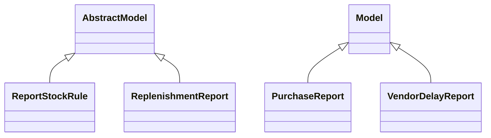

# Reports

Report definitions and templates in purchase_stock.

## Available Reports

### Analytical/Dashboard Reports
- **On-time Delivery** (Analysis/Dashboard)

## Report Files

- **__init__.py** (Python logic)
- **purchase_report.py** (Python logic)
- **purchase_report_templates.xml** (XML template/definition)
- **purchase_report_views.xml** (XML template/definition)
- **report_stock_forecasted.xml** (XML template/definition)
- **report_stock_rule.py** (Python logic)
- **report_stock_rule.xml** (XML template/definition)
- **stock_forecasted.py** (Python logic)
- **vendor_delay_report.py** (Python logic)
- **vendor_delay_report.xml** (XML template/definition)

## Notes
- Named reports above are accessible through Odoo's reporting menu
- Python files define report logic and data processing
- XML files contain report templates, definitions, and formatting
- Reports are integrated with Odoo's printing and email systems
