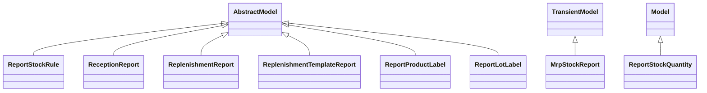

# Reports

Report definitions and templates in stock.

## Available Reports

### PDF/Document Reports
- **Reception Report** (PDF/Print)
- **Reception Report** (PDF/Print)
- **Picking Operations** (PDF/Print)
- **Delivery Slip** (PDF/Print)
- **Packages** (PDF/Print)
- **Count Sheet** (PDF/Print)
- **Package Barcode with Content** (PDF/Print)
- **Package Barcode (PDF)** (PDF/Print)
- **Location Barcode** (PDF/Print)
- **Lot/Serial Number (PDF)** (PDF/Print)
- **Operation type (PDF)** (PDF/Print)
- **Product Routes Report** (PDF/Print)
- **Product Label (ZPL)** (PDF/Print)
- **Lot/Serial Number (ZPL)** (PDF/Print)
- **Package Barcode (ZPL)** (PDF/Print)
- **Product Packaging (ZPL)** (PDF/Print)
- **Operation type (ZPL)** (PDF/Print)
- **Reception Report Label** (PDF/Print)

## Report Files

- **__init__.py** (Python logic)
- **package_templates.xml** (XML template/definition)
- **picking_templates.xml** (XML template/definition)
- **product_label_report.py** (Python logic)
- **product_packaging.xml** (XML template/definition)
- **product_templates.xml** (XML template/definition)
- **report_deliveryslip.xml** (XML template/definition)
- **report_location_barcode.xml** (XML template/definition)
- **report_lot_barcode.xml** (XML template/definition)
- **report_package_barcode.xml** (XML template/definition)
- **report_stock_forecasted.xml** (XML template/definition)
- **report_stockinventory.xml** (XML template/definition)
- **report_stockpicking_operations.xml** (XML template/definition)
- **report_stock_quantity.py** (Python logic)
- **report_stock_quantity.xml** (XML template/definition)
- **report_stock_reception.py** (Python logic)
- **report_stock_reception.xml** (XML template/definition)
- **report_stock_rule.py** (Python logic)
- **report_stock_rule.xml** (XML template/definition)
- **stock_forecasted.py** (Python logic)
- **stock_report_views.xml** (XML template/definition)
- **stock_traceability.py** (Python logic)

## Notes
- Named reports above are accessible through Odoo's reporting menu
- Python files define report logic and data processing
- XML files contain report templates, definitions, and formatting
- Reports are integrated with Odoo's printing and email systems
